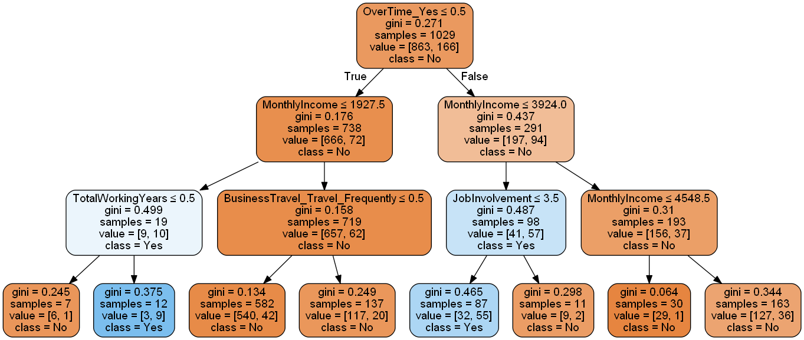

# IBM HR Analytics Employee Attrition & Performance

--------------------------------------------------------------------------------

## Problem Statement:

Human Resources are critical resources of any organization. Organizations spend huge amount of time and money to hire and nurture their employees. It is a huge loss for companies if employees leave, especially the key resources. Reasons for attrition can be plenty and range from dissatisfaction due to low salaries, less or no career growth opportunities, inferior employee supervision, eagerness to get into companies with global presence, lack of recognition, lack of freedom of expression in the organization and underutilization of talents and skills of the individuals. Thus in a situation when more and more employees are quitting the organization, the attrition rate is on a rise.
 So if HR can predict weather employees are at risk for leaving the company, it will allow them to identify the attrition risks and help understand and provide necessary support to retain those employees or do preventive hiring to minimize the impact to the organization.

## Objective:
The objective of the present report is to study factors like salary, satisfactory level, growth opportunities, facilities, policies and procedures, recognition, appreciation, suggestions of the employee’s by which it helps to know the Attrition level in the organizations and factors relating to retain them. This study also helps to find out where the organizations are lagging in retaining.

**Hypothesis:** 
1.	Employee attrition increases costs of recruitment, hiring and training replacement in the industries. 
2.	Employee attrition reduces production, and profit in the industries. 

## Approach
* Decision Tree Modeling: I have used Decision tree to create model. The major hurdle was we had 1223 unlabelled (No in Attrition) and 237 labelled (Yes in Attrition), which is a highly imbalanced data. So I used stratified sampling based on proportion of attrition in overall data.

* Model Evaluation: I have used the k fold cross validation technique for assessing how the results of a model will generalize to an independent test data set.  I used k =5 i.e.. 5 fold cross validation. Model was fit on the stratified sample data and tested on unmarked dataset.

* ROC Curve: The ROC curve is a simple plot that shows the trade-off between the true positive rate and the false positive rate of a classifier for various choices of the probability threshold. ROC area = 0.6128 and F1 = 0.81

## Suggested Action
* Improving the work conditions
  * Provide an option for the employee’s  to work from home, on a flexible schedule, or in an office with an ergonomic workspace, they will be more satisfied with their work and more likely to achieve a healthy work-life balance.
* Offer modest salaries and perks
  * To maintain the critical employee’s company need’s to offer equitable and modest salaries. You can also give added perks like flexible schedules, travel discounts etc.
* Employee Engagement
  * When you have talented employee’s we need to find ways that you can help expand the employee’s skill set, so that their involvement in the job increases. If their involvement is low, they will get bored and think that they are not growing within the organization

## Repository Contains
 - Data Folder -- Contains Raw Data Files (Data can be downloaded from [kaggle](https://www.kaggle.com/pavansubhasht/ibm-hr-analytics-attrition-dataset))
 - [AttritionAnalysis report](Attrition_Analysis_report.pdf) -- Employee Attrition Analysis Project Summary Report
 - [Employee-Attrition-Analysis_DT](Employee-Attrition-Analysis_DT.ipynb) -- Project Source Code File

### License & CopyRight
Copyright (c) 2018 [Niranjan Kumar](https://www.linkedin.com/in/niranjankumar-c/) Licensed under the [MIT License](LICENSE)

### Trademarks
All other trademarks referenced herein are the property of their respective owners.
